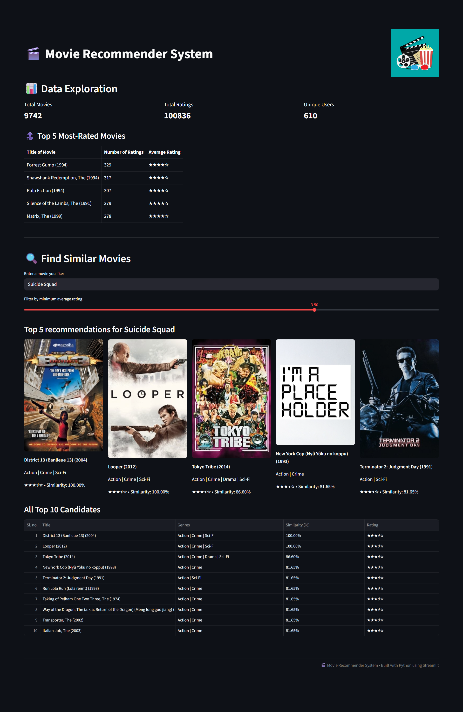

# 🎬 Movie Recommender System

A simple **content-based movie recommender** built with Python and Streamlit. Enter a movie you like, and the app recommends similar movies along with their posters fetched from **TMDB**.

---

## ✨ Features

- 🎥 **MovieLens Small Dataset** integration (movies + ratings)  
- 🤖 **Content-based recommendations** using genre similarity  
- ⭐ **Top-rated movies table** and **data exploration metrics**  
- 🖼️ **Poster display** for top recommendations using TMDB API  
- 🎚️ **Minimum rating filter** directly in the main UI  
- 📊 **Full top 10 recommendation table**  
- 🖌️ Clean and polished **Streamlit UI** with grid layout  

---

## 🖼️ Demo Screenshot


*Example layout showing top recommendations with posters.*

---

## 🚀 Getting Started

### 🔧 Prerequisites

- Python 3.8+  
- TMDB API Key ([Get one here](https://www.themoviedb.org/))  

### 🛠️ Installation

1. Clone this repository:

```bash
git clone https://github.com/yourusername/movie-recommender.git
cd movie-recommender
```

2. Create a virtual environment and activate it:

```bash
python -m venv venv
# Windows
venv\Scripts\activate
# macOS/Linux
source venv/bin/activate
```

3. Install dependencies:

```bash
pip install -r requirements.txt
```

4. Add your TMDB API key in `.streamlit/secrets.toml`:

```toml
[tmdb]
api_key = "YOUR_API_KEY_HERE"
```

5. Ensure the `assets/no_poster.png` file exists (used as a placeholder).

### ▶️ Running the App

```bash
streamlit run app.py
```

- Enter a movie title (partial or full) in the input box.
- Adjust the minimum rating filter if desired.
- View top 5 recommendations with posters and full top 10 table.

## ℹ️ Additional Information

### 📂 Dataset

**MovieLens Small Dataset**

Includes:

- `movies.csv` — movie titles & genres
- `ratings.csv` — user ratings

The app automatically downloads the dataset if not present.

### ⚙️ How It Works

1. Loads MovieLens dataset and extracts genres & year.
2. Builds a genre matrix and computes cosine similarity for content-based recommendations.
3. Filters recommendations by minimum average rating (if selected).
4. Fetches movie posters from TMDB using cleaned titles and year.
5. Displays results in a poster grid and a full table.

### 📦 Dependencies

- streamlit
- pandas
- numpy
- scikit-learn
- requests
- pillow

### ⚖️ License

[MIT License](LICENSE)

### 🤝 Acknowledgements

- MovieLens dataset
- TMDB API
- Built with Streamlit

### ⚠️ Warning

Currently this application cannot be hosted on Streamlit as free hosting servers have very limited resources to utilize. The app will work perfectly fine locally. Updates to fix the problem will be rolled out shortly 🙏