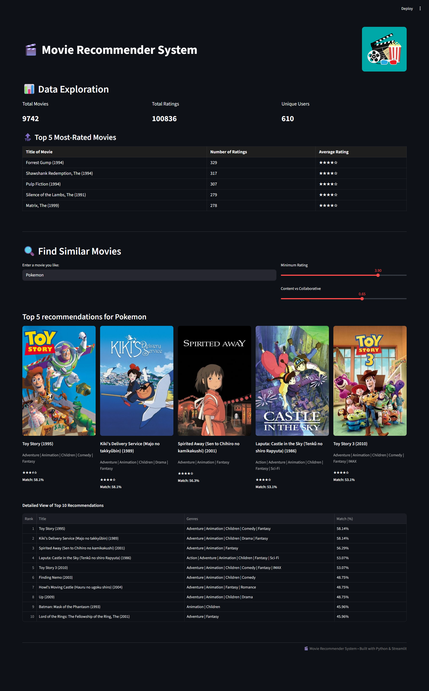

# 🎬 Movie Recommender System

A **hybrid movie recommender system** with content-based + collaborative filtering, built with Python and Streamlit. Enter a movie you like, and the app recommends similar movies along with their posters fetched from **TMDB**.

## ✨ Features

- 🎥 **MovieLens Small Dataset** integration (movies + ratings)  
- 🤖 **Hybrid recommendation system** (content-based + collaborative filtering)  
- 🧠 **Cosine similarity** on genres + user rating patterns  
- ⭐ **Weighted rating system (IMDb-style)** for better ranking  
- 🎚️ **Adjustable hybrid slider** (content vs collaborative balance)  
- 🔍 **Improved movie matching** using RapidFuzz (with fallback to SequenceMatcher) 
- 🖼️ **Poster display** using TMDB API  
- 📊 **Top-rated movies table** and dataset insights  
- 🖌️ Clean and responsive **Streamlit UI**

## 🧠 Recommendation Approach

This app uses a **hybrid recommendation system**:

- **Content-based filtering** → recommends movies with similar genres  
- **Collaborative filtering** → recommends movies liked by similar users  
- **Hybrid scoring** → combines both using a weighted formula:

`Final Score = (w × Content Similarity) + ((1 - w) × Collaborative Similarity)`

Users can adjust the balance using the **content vs collaborative slider** in the UI.

## ⚙️ How It Works

1. Loads MovieLens dataset and extracts genres & year.  
2. Builds a **content-based** representation using genre encoding.
3. Builds a **collaborative filtering matrix** from user ratings.
4. Applies **mean-centering** to normalize rating patterns.
5. Computes similarity using **cosine similarity* *(on demand)***.
6. Combines both signals using a **weighted hybrid score**.  
7. Applies **IMDb-style weighted rating filtering** for quality control.  
8. Fetches movie posters from TMDB using cleaned titles and year.  
9. Displays:
    - 🎬 Top 5 recommendations (poster grid)
    - 📊 Top 10 recommendations (detailed table)

## 🖼️ Demo Screenshot


*Example layout showing top recommendations with posters.*

## 🚀 Getting Started

### 🔧 Prerequisites

- Python 3.8+  
- TMDB API Key ([Get one here](https://www.themoviedb.org/))  

### 🛠️ Installation

1. Clone this repository:

```bash
git clone https://github.com/HeX-ecutioner/movie-recommender.git
cd movie-recommender
```

2. Create a virtual environment and activate it:

```bash
python -m venv venv
# Windows
venv\Scripts\activate
# macOS/Linux
source venv/bin/activate
```

3. Install dependencies:

```bash
pip install -r requirements.txt
```

4. Add your TMDB API key in `.streamlit/secrets.toml`:

```toml
[tmdb]
api_key = "YOUR_API_KEY_HERE"
```

### ▶️ Running the App

```bash
streamlit run app.py
```

- Enter a movie title (partial or full) in the input box.
- Adjust the minimum rating filter and hybrid weight slider if desired.
- View top 5 recommendations with posters and full top 10 table.

## ℹ️ Additional Information

### 📂 Dataset

**MovieLens Small Dataset**

Includes:

- `movies.csv` — movie titles & genres
- `ratings.csv` — user ratings

The app automatically downloads the dataset if not present.

### 📦 Dependencies

- streamlit
- numpy
- pandas
- scikit-learn
- requests
- pillow
- rapidfuzz

### ⚖️ License

This app uses the [MIT License](LICENSE)

### 🤝 Acknowledgements

- MovieLens dataset
- TMDB API
- Built with Streamlit