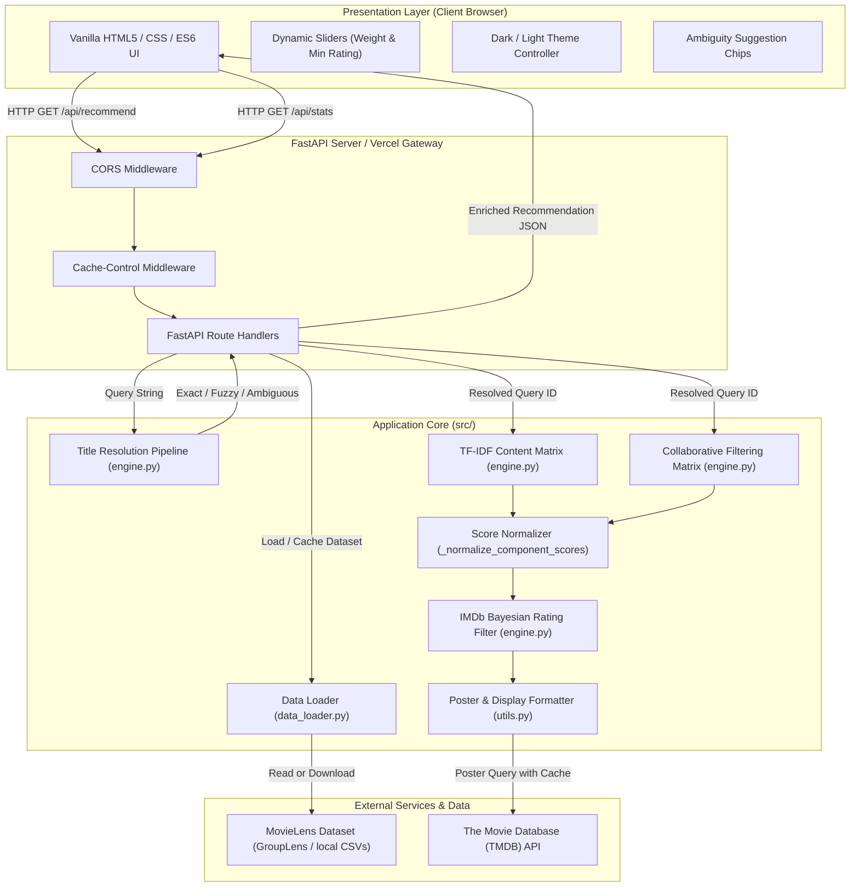

# 🏗️ Cine Expert System Architecture

This document details the architectural design, component separation, data flow, directory layout, and deployment models of the **Cine Expert** application.

## 1. Architectural Philosophy

Cine Expert is built on three core architectural principles:

1. **Strict Decoupling**: The presentation layer (`public/`) is completely decoupled from the computation layer (`api/` and `src/`). The frontend interacts with the backend strictly via standardized JSON REST APIs.
2. **Zero-Build Frontend**: The frontend is written in pure semantic HTML5, modern Vanilla CSS, and ES6+ JavaScript. It requires no Node.js compilation, bundlers, or heavy framework overhead, allowing instant local loads and sub-millisecond static asset delivery.
3. **Serverless Compatibility**: The backend is designed to run seamlessly as a Vercel Serverless Function (`@vercel/python`) within memory and execution constraints, as well as a long-running ASGI process under `uvicorn` for local development.

## 2. High-Level Architecture Diagram



## 3. Directory Layout & File Structure

```
cine-expert/
├── .env.example                 # Template for required environment variables (TMDB_API_KEY)
├── .gitattributes               # Linguist detection management
├── .gitignore                   # Excludes venv, pycache, data caches, and local logs
├── CHANGELOG.md                 # Project release notes and historical version changes
├── CODE_OF_CONDUCT.md           # Contributor Covenant community conduct guidelines
├── CONTRIBUTING.md              # Guidelines for contributing, issue filing, and PRs
├── LICENSE                      # MIT Open-Source License
├── pyproject.toml               # Modern Python packaging and project build metadata
├── README.md                    # Project landing page and overview
├── requirements.txt             # Python dependencies (FastAPI, scikit-learn, etc.)
├── SECURITY.md                  # Security vulnerability disclosure and reporting policy
├── vercel.json                  # Vercel serverless build and routing configuration
│
├── api/
│   └── index.py                 # FastAPI application factory, middleware, and route endpoints
│
├── data/                        # Local MovieLens CSV storage (optional fallback)
│   ├── movies.csv
│   ├── ratings.csv
│   └── tags.csv
│
├── docs/                        # Comprehensive technical documentation suite
│   ├── ARCHITECTURE.md          # System architecture and design
│   ├── RECOMMENDATION_ENGINE.md # Recommendation theory, normalization, and math
│   ├── TITLE_RESOLUTION.md      # Multi-tier title resolver and ambiguity protocol
│   ├── API.md                   # RESTful API specifications and schema contracts
│   └── FRONTEND.md              # Frontend UI design system and client logic
│
├── public/                      # Static client-side assets
│   ├── favicon.jpg              # Application branding icon
│   ├── index.html               # Main single-page application structure
│   ├── script.js                # Frontend client logic, event handlers, and API calls
│   └── styles.css               # Design system tokens, glassmorphism, and responsive layout
│
├── src/                         # Python recommendation engine and utilities
│   ├── __init__.py
│   ├── data_loader.py           # Dataset retrieval, caching, cleaning, and soup generation
│   ├── engine.py                # Hybrid recommendation algorithms, normalization, and resolver
│   └── utils.py                 # TMDB API client, poster caching, title display formatting
│
└── tests/                       # Automated test suite
    ├── test_ambiguity.py        # Ambiguity detection, response schemas, and natural titles
    ├── test_hybrid_scoring.py   # Hybrid score normalization bounds and weight blend tests
    └── test_title_resolution.py # Exact direct, canonical, and year-constrained resolver tests
```

## 4. Backend Architecture

### 4.1 Application Lifecycle & Data Ingestion
When the FastAPI application initializes (`api/index.py`):
1. `load_data()` in `src/data_loader.py` retrieves the MovieLens Small dataset (9,742 movies, 100,836 ratings, 3,683 tags).
   - If present in `data/`, it reads local CSVs.
   - If missing, it automatically downloads and extracts the GroupLens archive to the system temporary directory.
   - Cached via `@lru_cache(maxsize=1)` to avoid redundant I/O operations.
2. In-memory precomputation:
   - `aggregate_ratings()` calculates average ratings, rating counts, and global Bayesian weighted rating priors.
   - `compute_content_features()` fits a TF-IDF vectorizer over the metadata soup and generates a dense float32 array.
   - `compute_collaborative_features()` pivots the ratings into an item-user matrix, mean-centers each movie's ratings, and fills unrated entries with zeros.

### 4.2 Middleware Configuration
- **CORS Middleware**: Allows cross-origin requests from any domain (`*`) to support external consumers or decoupled development hosts.
- **Cache-Control Middleware**:
  ```python
  @app.middleware("http")
  async def add_cache_control_header(request, call_next):
      response = await call_next(request)
      if any(request.url.path.endswith(ext) for ext in (".css", ".js", ".html")):
          response.headers["Cache-Control"] = "no-cache, must-revalidate"
      return response
  ```
  This ensures that updates to static CSS and JavaScript assets are immediately reflected in client browsers without stale caching issues during development or deployment.

### 4.3 Static File Mounting vs. API Precedence
In `api/index.py`, static files are mounted at the very bottom of the file:
```python
public_dir = os.path.join(os.path.dirname(os.path.dirname(os.path.abspath(__file__))), "public")
if os.path.exists(public_dir):
    app.mount("/", StaticFiles(directory=public_dir, html=True), name="public")
```
Mounting `StaticFiles` *after* defining `/api/stats` and `/api/recommend` guarantees that API routes are evaluated first, preventing static routing from intercepting dynamic API endpoints.

## 5. Frontend Architecture

### 5.1 Presentation Philosophy
The frontend uses standard Web APIs without external JavaScript frameworks (no React, Vue, or Angular dependencies). This ensures:
- **Instant Paint**: Eliminates JavaScript bundle parsing overhead.
- **Maintainability**: Clear separation of concern between `index.html` (DOM structure), `styles.css` (visual tokens and layout), and `script.js` (DOM manipulation and fetch calls).
- **Accessibility**: Standard semantic elements (`<nav>`, `<main>`, `<section>`, `<label>`, `<button>`, `<table>`).

### 5.2 State Management
The UI maintains lightweight client-side state:
- **Theme Preference**: Toggled via `#themeToggle` and stored on `<html data-theme="dark|light">`.
- **Search Parameters**: Real-time slider listeners update UI text (`#ratingVal`, `#weightVal`) and pass query parameters to `/api/recommend`.
- **Response Handling**:
  - `status === "ambiguous"`: Dynamically constructs interactive suggestion chips (`.suggestion-chip`) inside `#errorMessage.ambiguity-banner`.
  - Recommendations found: Dynamically populates `#movieGrid` (top 5 with posters) and `#detailsTableBody` (top 10 analytical breakdown).
  - Empty or error: Renders a standardized error alert banner.

## 6. Deployment Models

### 6.1 Serverless Deployment (Vercel)
The application includes a specialized `vercel.json` specification:
```json
{
  "builds": [
    {
      "src": "api/index.py",
      "use": "@vercel/python"
    },
    {
      "src": "public/**",
      "use": "@vercel/static"
    }
  ],
  "routes": [
    {
      "src": "/api/(.*)",
      "dest": "/api/index.py"
    },
    {
      "src": "/",
      "dest": "/public/index.html"
    },
    {
      "src": "/(.*)",
      "dest": "/public/$1"
    }
  ]
}
```
- **Routing**: Incoming requests to `/api/*` invoke the Python serverless runtime running `api/index.py`. All other routes are served directly by Vercel's global CDN via `@vercel/static`.
- **Stateless Execution**: Precomputed matrices are kept warm in serverless instance memory across requests.

### 6.2 Local Development Server
Locally, the application runs via ASGI:
```bash
uvicorn api.index:app --reload
```
In this mode, FastAPI handles both the API routes and serves the static files in `public/` directly through the mounted `StaticFiles` handler at `http://localhost:8000`.
