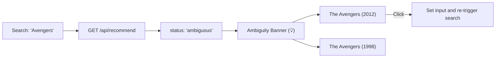

# 🎨 Cine Expert Frontend & UI Guide

This document details the frontend architecture, CSS design system tokens, interactive components, ambiguity UX, and cache invalidation strategies used in the Cine Expert web application.

## 1. Frontend Philosophy & Technology Stack

The Cine Expert user interface is built strictly with:
- **Semantic HTML5** (`public/index.html`)
- **Vanilla CSS3** (`public/styles.css`) with custom properties (CSS variables)
- **Modern ES6+ JavaScript** (`public/script.js`)

### Key Design Tenets:
1. **Zero External Framework Overhead**: No React, Vue, Angular, or Tailwind compiler steps. The client loads instantly with sub-second First Contentful Paint (FCP).
2. **Atmospheric Glassmorphism**: Translucent cards with backdrop blur filters, glowing border accents, and animated ambient lighting orbs.
3. **Seamless Responsiveness**: Fluid layouts leveraging CSS Grid and Flexbox that adapt seamlessly from mobile devices (320px) to ultra-wide displays (4K).
4. **Instant Interactive Feedback**: Real-time slider number updates, loading spinners, and clickable suggestion chips.

## 2. Design System Tokens (CSS Variables)

The design system is centralized around CSS custom properties defined in [`public/styles.css`](file:///c:/Users/Sagnik/Documents/GitHub%20repos/cine-expert/public/styles.css). The system supports both **Dark Mode** (default) and **Light Mode**:

| Token Name | Dark Mode Value | Light Mode Value | Description |
| :--- | :--- | :--- | :--- |
| `--bg-main` | `#0b0f19` | `#f8fafc` | Base background color of the viewport. |
| `--bg-surface` | `rgba(17, 24, 39, 0.7)` | `rgba(255, 255, 255, 0.8)` | Elevated panel background with opacity. |
| `--bg-card` | `rgba(31, 41, 55, 0.6)` | `rgba(255, 255, 255, 0.9)` | Card element background. |
| `--primary` | `#6366f1` (Indigo) | `#4f46e5` (Darker Indigo) | Brand primary color. |
| `--primary-glow`| `rgba(99, 102, 241, 0.35)` | `rgba(79, 70, 229, 0.2)` | Primary glow effect for buttons and hover states. |
| `--secondary` | `#ec4899` (Pink) | `#db2777` (Darker Pink) | Accent color for text gradients and highlights. |
| `--text-main` | `#f3f4f6` | `#0f172a` | High-contrast primary text color. |
| `--text-muted`| `#9ca3af` | `#64748b` | Subdued secondary and meta text color. |
| `--border` | `rgba(255, 255, 255, 0.08)` | `rgba(0, 0, 0, 0.08)` | Subtle translucent borders. |
| `--glass-blur`| `16px` | `16px` | CSS backdrop filter blur radius. |

## 3. Core UI Components

### 3.1 Sticky Navbar & Theme Switcher
- **Branding**: Displays the Cine Expert icon and bold title with Outfit typography.
- **Theme Toggle**: A smooth animated pill slider switch controlling `<html data-theme="dark|light">`.
- **Navigation Anchor**: Direct smooth-scrolling link to `#platform-stats`.

### 3.2 Ambient Glow Orbs
Three positioned radial gradient elements (`.glow-orb`) create subtle neon depth behind the glass cards:
```css
.glow-orb {
    position: absolute;
    filter: blur(120px);
    z-index: -1;
    pointer-events: none;
}
.orb-1 { top: 10%; left: 15%; width: 450px; height: 450px; background: radial-gradient(circle, rgba(99, 102, 241, 0.25) 0%, transparent 70%); }
.orb-2 { top: 35%; right: 10%; width: 500px; height: 500px; background: radial-gradient(circle, rgba(236, 72, 153, 0.2) 0%, transparent 70%); }
```

### 3.3 Hero Search Bar
- **Input Field**: High-contrast glass input with an embedded SVG search icon.
- **Trigger Mechanisms**: Submits when clicking the "Recommend" button or pressing the `Enter` key.
- **Interactive Sliders**:
  - **Minimum Rating**: Range `0.0 - 5.0` (step `0.1`), default `3.90`.
  - **Content vs. Collaborative Weight**: Range `0.0 - 1.0` (step `0.05`), default `0.65`. Real-time event listeners update numeric indicator badges without page reloads.

### 3.4 Ambiguity Banner & Suggestion Chips

When a search is ambiguous (e.g., searching for `"Avengers"` or `"Batman"`), the UI constructs an interactive clarifying banner:



#### Visual Styling:
- **Theme**: Warm amber glassmorphic palette (`rgba(245, 158, 11, 0.12)`).
- **Interactive Chips** (`.suggestion-chip`):
  - Subtle glowing border (`rgba(245, 158, 11, 0.25)`).
  - Hover transformation (`transform: translateY(-2px)` with amber glow).
  - Click listener that immediately populates the search bar and triggers `searchMovies()`.

### 3.5 Top 5 Recommendations Grid
- **CSS Grid**: Responsive columns using `grid-template-columns: repeat(auto-fit, minmax(220px, 1fr))`.
- **Card Hierarchy**:
  1. Poster image (or `.no-poster` placeholder if TMDB is unavailable).
  2. Movie title in natural English formatting.
  3. Pipe-delimited genre pills.
  4. Dynamic star rating.
  5. Percentage match score pill (`Match: 85.4%`).
- **Micro-Animations**: Cards enter via an `@keyframes fadeInUp` animation with staggered CSS transition delays (`style.animationDelay = (index * 0.1)s`).

### 3.6 Analytical Deep-Dive Table
Provides a full comparative breakdown of the **Top 10** recommendation matches:
- Rank number badge.
- Formatted movie title.
- Genre metadata.
- High-precision match percentage (formatted to 2 decimal places).

### 3.7 Platform Statistics Dashboard
- **Metric Cards**: Display total movies, total user ratings, and unique platform users.
- **Top Rated Classics Table**: Features the most frequently reviewed movies, with a custom JavaScript star renderer:
  ```javascript
  function renderStars(rating) {
      const full = Math.floor(rating);
      const half = rating - full >= 0.5 ? 1 : 0;
      const empty = 5 - full - half;
      return '★'.repeat(full) + (half ? '⯨' : '') + '☆'.repeat(empty);
  }
  ```

## 4. Asset Caching & Cache Invalidation

To ensure local and deployed environments immediately reflect CSS and JavaScript updates without stale browser caching:
1. **Query-Parameter Versioning in HTML**:
   ```html
   <link rel="stylesheet" href="styles.css?v=1.1.0">
   ```
2. **FastAPI Cache-Control Middleware**:
   ```python
   @app.middleware("http")
   async def add_cache_control_header(request, call_next):
       response = await call_next(request)
       if any(request.url.path.endswith(ext) for ext in (".css", ".js", ".html")):
           response.headers["Cache-Control"] = "no-cache, must-revalidate"
       return response
   ```
   This combination guarantees that whenever CSS or JS changes, browsers immediately fetch fresh assets while retaining HTTP 200/304 validation efficiency.
