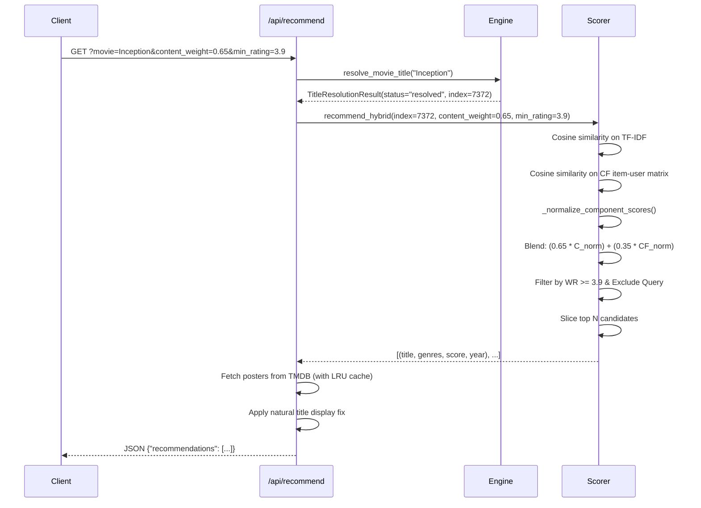

# 🧠 Cine Expert Recommendation Engine & Algorithms

This document provides an in-depth mathematical and algorithmic explanation of the hybrid recommendation engine in Cine Expert, implemented primarily in [`src/engine.py`](../src/engine.py).

## 1. Overview of the Hybrid Architecture

Recommender systems typically suffer from trade-offs when relying on a single filtering paradigm:
- **Content-Based Filtering**: Highly effective for discovering movies with similar themes, genres, and metadata, and immune to the cold-start problem for low-interaction movies. However, it cannot recommend cross-genre surprises or capture communal taste patterns.
- **Collaborative Filtering**: Discovers latent connections between films based on real user rating habits, identifying serendipitous recommendations. However, it suffers from sparsity and cold-start degradation.

Cine Expert combines both paradigms into a unified, normalized **hybrid scoring engine**:

$$\text{Score}_{\text{hybrid}}(i) = w \cdot C_{\text{norm}}(i) + (1 - w) \cdot CF_{\text{norm}}(i)$$

where $w \in [0.0, 1.0]$ is the content weight parameter adjustable via the UI slider or API.

## 2. Content-Based Filtering Pipeline

### 2.1 Metadata Soup Construction
In [`src/data_loader.py`](../src/data_loader.py), metadata is consolidated into a unified text document ("soup") for each movie:
1. **Genres**: Extracted from `movies.csv`, with vertical bars (`|`) replaced by spaces.
2. **User Tags**: Extracted from `tags.csv`, grouped by `movieId`, converted to lowercase, and joined into space-delimited text.
3. **Combination**:
   $$\text{Metadata Soup}_i = \text{genres}_i \mathbin{\Vert} \text{tags}_i$$

*Example*:
> For *The Dark Knight (2008)*:
> `"action crime drama imax christian bale heath ledger batman superhero dark vigilante ..."`

### 2.2 TF-IDF Vectorization
The text soup is processed using scikit-learn's `TfidfVectorizer(stop_words="english")`:
- Common English stopwords ("the", "and", "is") are eliminated.
- Term Frequency ($TF$) and Inverse Document Frequency ($IDF$) are computed:
  $$\text{TF}(t, d) = \frac{f_{t, d}}{\sum_{t' \in d} f_{t', d}}$$
  $$\text{IDF}(t, D) = \log\left(\frac{1 + |D|}{1 + |\{d \in D : t \in d\}|}\right) + 1$$
  $$\text{TF-IDF}(t, d, D) = \text{TF}(t, d) \times \text{IDF}(t, D)$$

Each movie is converted into a normalized, dense $L_2$ feature vector $\mathbf{c}_i \in \mathbb{R}^V$, where $V$ is the vocabulary size.

### 2.3 Content Cosine Similarity
For a query movie with index $q$, cosine similarity against all movies $i \in \{1, \dots, N\}$ is computed as:
$$\text{sim}_{\text{content}}(q, i) = \frac{\mathbf{c}_q \cdot \mathbf{c}_i}{\|\mathbf{c}_q\|_2 \|\mathbf{c}_i\|_2} = \mathbf{c}_q \cdot \mathbf{c}_i$$
Because vectors are $L_2$-normalized and non-negative, $\text{sim}_{\text{content}}(q, i) \in [0.0, 1.0]$.

## 3. Collaborative Filtering Pipeline

### 3.1 Item-User Matrix Formulation
In `compute_collaborative_features()`:
1. Ratings are pivoted into an item-user interaction matrix $R \in \mathbb{R}^{M \times U}$, where rows represent movies ($M = 9,742$) and columns represent users ($U = 610$).
2. Missing entries indicate that a user has not rated that movie.

### 3.2 Mean-Centering (Item Pearson Formulation)
User rating scales vary widely (some users are lenient and rate everything $\ge 4.0$, while others rarely award $\ge 3.0$). To account for this, each movie's ratings are mean-centered across active raters:

$$\bar{R}_i = \frac{1}{|U_i|} \sum_{u \in U_i} R_{i, u}$$
$$\tilde{R}_{i, u} = \begin{cases} R_{i, u} - \bar{R}_i & \text{if user } u \text{ rated movie } i \\ 0 & \text{otherwise} \end{cases}$$

Filling unrated entries with $0.0$ assumes an uninformative prior (the user is expected to rate at the movie's average).

### 3.3 Collaborative Cosine Similarity
Cosine similarity over the mean-centered item vectors $\tilde{\mathbf{r}}_i$ corresponds directly to the Pearson correlation coefficient between items:

$$\text{sim}_{\text{CF}}(q, i) = \frac{\sum_{u \in U_q \cap U_i} (R_{q, u} - \bar{R}_q)(R_{i, u} - \bar{R}_i)}{\sqrt{\sum_{u \in U_q} (R_{q, u} - \bar{R}_q)^2} \sqrt{\sum_{u \in U_i} (R_{i, u} - \bar{R}_i)^2}}$$

This produces correlation values theoretically in the interval $[-1.0, 1.0]$.

## 4. Component Normalization Strategy (`_normalize_component_scores`)

### 4.1 The Distribution Mismatch Challenge
Raw content similarity and collaborative filtering similarity cannot be directly blended:
1. **Range Disparity**: Content similarities span $[0.0, 1.0]$ with strong positive peaks, whereas CF similarities span $[-1.0, 1.0]$ with realistic positive correlations clustered tightly between $0.05$ and $0.40$.
2. **Negative Correlations**: A negative CF correlation indicates inverse taste (users who liked $q$ disliked $i$). These must not contribute positively to a recommendation.
3. **Dynamic Scaling Pitfall**: If one normalizes CF by dividing by $\max(\text{CF})$ on a per-query basis, a query movie with only weak or noisy CF correlations (e.g., maximum correlation of $0.08$) would artificially inflate that noise to $1.0$, completely corrupting the hybrid balance.

### 4.2 The Solution: Reference Ceiling Normalization
Implemented in `src/engine.py`, `_normalize_component_scores()` establishes a mathematically robust, stable mapping:

```python
def _normalize_component_scores(content_scores, cf_scores, query_idx=None, cf_ref=0.5):
    # 1. Clean NaN and Inf values
    c = np.nan_to_num(np.asarray(content_scores, dtype=np.float32), nan=0.0, posinf=0.0, neginf=0.0)
    cf = np.nan_to_num(np.asarray(cf_scores, dtype=np.float32), nan=0.0, posinf=0.0, neginf=0.0)

    # 2. Bound content scores strictly to [0.0, 1.0]
    c_norm = np.clip(c, 0.0, 1.0)

    # 3. Zero-clip negative CF correlations
    cf_pos = np.maximum(0.0, cf)

    # 4. Scale by stable reference ceiling
    scale = max(float(cf_ref), 1e-6)
    cf_norm = np.clip(cf_pos / scale, 0.0, 1.0)

    # 5. Suppress self-similarity for query item
    if query_idx is not None and 0 <= query_idx < len(c_norm):
        c_norm[query_idx] = 0.0
    if query_idx is not None and 0 <= query_idx < len(cf_norm):
        cf_norm[query_idx] = 0.0

    return c_norm, cf_norm
```

### Key Mathematical Invariants:
- **Reference Ceiling ($CF_{\text{ref}} = 0.50$)**: In collaborative filtering across sparse datasets, a correlation $\ge 0.50$ represents an exceptionally strong co-rating affinity. Items reaching or exceeding this threshold attain a normalized score of $1.0$, while weak correlations (e.g., $0.05$) remain low ($0.10$).
- **Strict $[0.0, 1.0]$ Output**: Both $C_{\text{norm}}$ and $CF_{\text{norm}}$ are guaranteed to lie within $[0.0, 1.0]$.
- **Query Self-Exclusion**: Setting $C_{\text{norm}}[idx] = 0$ and $CF_{\text{norm}}[idx] = 0$ ensures the query movie itself never appears in recommendations.

## 5. IMDb-Style Bayesian Weighted Rating Filter

Popularity and quality control are enforced using an IMDb-style Bayesian weighted rating calculated during data startup in `aggregate_ratings()`:

$$WR = \left(\frac{v}{v + m}\right) R + \left(\frac{m}{v + m}\right) C$$

Where:
- $v$: Total number of ratings received by the candidate movie (`num_ratings`).
- $m$: Minimum rating count threshold, defined as the **60th percentile** of all rating counts in the dataset (`agg["num_ratings"].quantile(0.6)`).
- $R$: Arithmetic mean rating of the candidate movie (`avg_rating`).
- $C$: Global mean rating across all movies in the dataset ($\approx 3.53$).

### Behavioral Impact:
- **Low-count bias prevention**: A movie with three 5.0-star ratings will have $v \ll m$, pulling its score down toward global mean $C$.
- **High-count validation**: A classic film with 200 ratings and a 4.4 average maintains its high score because $\frac{v}{v + m} \approx 1.0$.
- **Threshold filtering**: In `recommend_hybrid()`, candidates with $WR < \text{min\_avg\_rating}$ (default $3.5$) are excluded from the result set.

## 6. End-to-End Recommendation Flow


