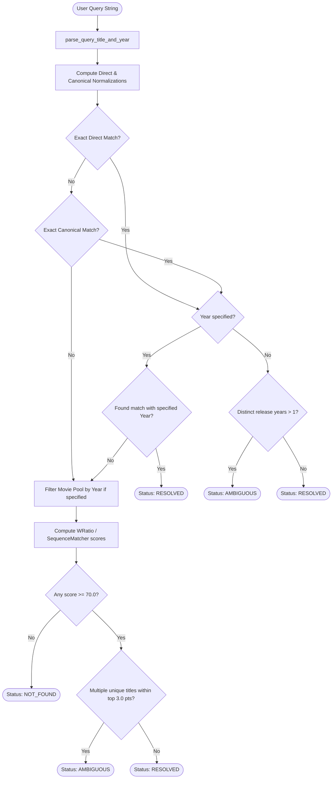

# 🔍 Title Resolution, Ambiguity Protocol, & Title Formatting

This document details the multi-stage title resolution architecture, ambiguity handling protocol, and user-facing title formatting implemented in [`src/engine.py`](../src/engine.py) and [`src/utils.py`](../src/utils.py).

## 1. The Challenge of Movie Title Resolution

In real-world recommender systems, user search queries exhibit extreme variety and ambiguity:
1. **Inverted Dataset Articles**: Standard datasets like MovieLens store titles with trailing inverted articles, e.g., `Avengers, The (2012)` and `Dark Knight, The (2008)`.
2. **Title Collisions Across Release Years**: Iconic titles are frequently remade or rebooted across decades. For example, querying `"Avengers"` could refer to:
   - *The Avengers (2012)* (Joss Whedon / Marvel superhero film)
   - *The Avengers (1998)* (Ralph Fiennes & Uma Thurman spy film)
   Similarly, querying `"Batman"` could refer to 1966, 1989, or various reboot titles.
3. **Flexible Query Formats**: Users may search with or without parentheses, e.g., `"Batman Begins (2005)"`, `"The Avengers 2012"`, or `"dark knight"`.
4. **Fuzzy Typos**: Queries may contain slight typos or omissions.

## 2. Multi-Stage Resolution Pipeline

The title resolution engine (`resolve_movie_title` in `src/engine.py`) follows a strictly ordered 4-stage matching hierarchy:



### Stage 1: Query & Year Parsing (`parse_query_title_and_year`)
The engine extracts both the base title and an optional release year:
- **Parenthetical Year**: `^(.*?)\s*\((\d{4})\)$` $\to$ Matches `"Batman Begins (2005)"` $\to$ `("Batman Begins", 2005)`
- **Space-Delimited Year**: `^(.*?)\s+(\d{4})$` $\to$ Matches `"The Avengers 2012"` $\to$ `("The Avengers", 2012)` (validated between 1880 and 2035)

### Stage 2: Exact Direct Matching (`direct_title_norm`)
- Strips punctuation and whitespace while **preserving articles**.
- Normalizes both query and dataset candidates to lowercase alphanumeric strings.
- Example: `"The Dark Knight"` matches `direct_norm` of `"The Dark Knight (2008)"`.

### Stage 3: Exact Canonical Matching (`canonical_title_norm`)
- Normalizes titles by stripping leading English articles (`"the "`, `"a "`, `"an "`).
- Allows article-insensitive lookup: `"Dark Knight"` successfully resolves to `"Dark Knight, The (2008)"`.

### Handling Multiple Years in Exact Matches
If an exact match (direct or canonical) matches movies with **multiple distinct release years** and the user **did not provide a year**:
- The engine marks the result as `status="ambiguous"`.
- It collects all matching candidates and passes them to the API ambiguity handler.

### Stage 4: Fuzzy Matching Fallback
Used only if exact matching fails:
1. If a release year was supplied in the query, the candidate pool is strictly restricted to that release year (`movies_df["year"] == q_year`).
2. Calculates similarity using `rapidfuzz.fuzz.WRatio` (or `difflib.SequenceMatcher` fallback) against both the natural display title (`title_search`) and clean base title (`title_clean`).
3. Candidates must meet a minimum score threshold of **$\ge 70.0$**.
4. **Fuzzy Ambiguity Window**: Candidates within **$3.0$ points** of the top score (`score >= best_score - 3.0`) are examined. If multiple distinct movies lie within this margin, the query is classified as `ambiguous`.

## 3. Ambiguity Protocol & API Contract

When a query is ambiguous, the backend does not return an empty array or guess incorrectly. Instead, it returns HTTP 200 with an explicit ambiguity payload:

```json
{
  "recommendations": [],
  "status": "ambiguous",
  "query": "Avengers",
  "message": "Multiple movies matched \u201cAvengers\u201d. Please include a year, such as \u201cThe Avengers (2012)\u201d.",
  "matches": [
    {
      "title": "The Avengers (2012)",
      "year": 2012
    },
    {
      "title": "The Avengers (1998)",
      "year": 1998
    }
  ]
}
```

### Popularity-Ranked Exemplar:
In `api/index.py`, candidates are sorted by their historical popularity count (`rating_agg["num_ratings"]`). The most popular candidate is selected as the exemplar in the clarifying message (e.g. *The Avengers (2012)* rather than the obscure 1998 film).

### Client UI Integration:
The frontend (`public/script.js`) intercepts `data.status === "ambiguous"` and renders an interactive banner with clickable **suggestion chips**:
- Each chip displays the natural title with year.
- Clicking a chip populates the input field and automatically triggers a new search.

## 4. User-Facing Title Formatting (`fix_title_display`)

### The Inverted Article Problem
In the raw MovieLens dataset, movies with leading articles are formatted with trailing commas:
- `Avengers, The (2012)`
- `Dark Knight, The (2008)`
- `Lives of Others, The (Das Leben der Anderen) (2006)`

Presenting these raw strings in the UI degrades user experience.

### Implementation in `src/utils.py`
```python
def fix_title_display(title):
    if not title or not isinstance(title, str):
        return "" if title is None else str(title)

    # Separate release year if present
    match = re.search(r"^(.*?)(\s*\(\d{4}\))?$", title)
    if not match:
        return title

    name = match.group(1).strip()
    year = match.group(2) or ""

    # Detect trailing inverted article with optional foreign title parenthetical
    art_match = re.search(r"^(.*?),\s*(The|A|An)(\s+\([^)]*?\))?$", name, re.IGNORECASE)
    if art_match:
        base = art_match.group(1).strip()
        article = art_match.group(2).capitalize()
        extra = art_match.group(3) or ""
        return f"{article} {base}{extra}{year}"

    return name + year
```

### Data Integrity Principle:
The canonical titles inside `movies.csv` and internal matrices are **never mutated**. This guarantees:
- Fast, deterministic lookups across Pandas dataframes.
- Stable joins between ratings and movies.
- All conversions to natural formatting happen strictly on the presentation and API response boundaries (`api/index.py`).
